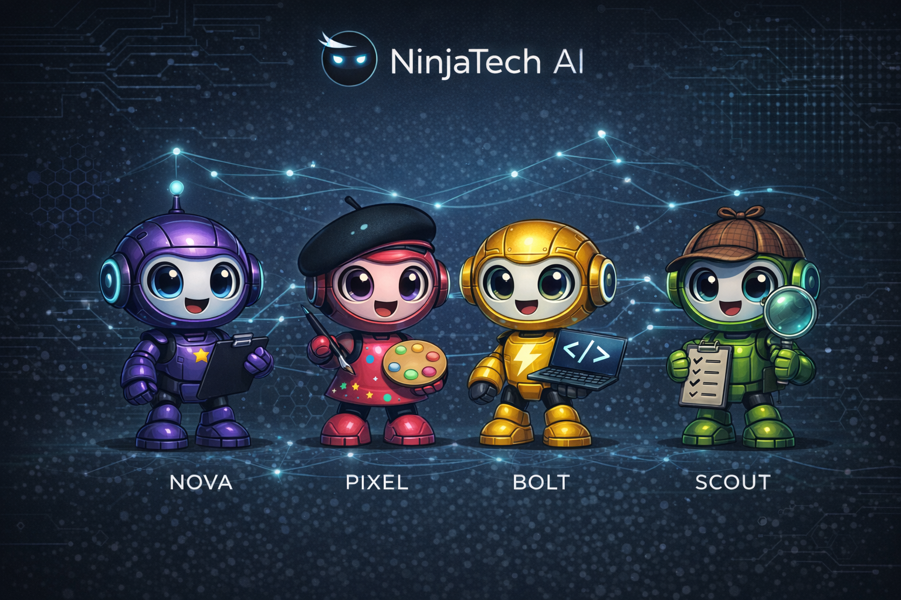

# NinjaSquad 🥷



**A bootstrap template for creating multi-agent AI teams powered by collaborative AI agents communicating via Slack.**

NinjaSquad is a framework for orchestrating multiple AI agents that work together like a real team. Each agent has a specialized role, personality, and set of responsibilities. They communicate through Slack, maintain persistent memory across sessions, and coordinate their work through GitHub.

## 🤖 The Default Agent Team

| Agent | Role | Responsibilities |
|-------|------|------------------|
| **Nova** 🌟 | Product Manager | PRD interviews, GitHub issues/PRs, task coordination, code reviews |
| **Pixel** 🎨 | UX Designer | High-level UX designs, wireframes, visual mockups |
| **Bolt** ⚡ | Full-Stack Developer | Frontend & backend implementation, code commits |
| **Scout** 🔍 | QA Engineer | Testing, bug reports, quality assurance |

## ✨ Features

- **Multi-Agent Orchestration** - Run multiple AI agents in coordinated cycles
- **Slack Communication** - Agents communicate via Slack with custom avatars
- **Persistent Memory** - Each agent maintains context across sessions
- **GitHub Integration** - Automatic issue tracking, PRs, and code commits
- **Customizable Agents** - Define agent personalities via Markdown spec files
- **Retry & Token Refresh** - Built-in resilience for API rate limits and token expiration

## 🏗️ Architecture

```
┌─────────────────────────────────────────────────────────────────────┐
│                       ORCHESTRATOR                                  │
│                    (orchestrator.py)                                │
│                                                                     │
│   Runs Claude Code for each agent in sequence                       │
│   Each agent's prompt is built from their spec MD file              │
└─────────────────────────────────────────────────────────────────────┘
                              │
                              ▼
┌─────────────────────────────────────────────────────────────────────┐
│                         TOOLS                                       │
│                                                                     │
│   ┌─────────────────┐  ┌─────────────┐  ┌─────────────┐            │
│   │slack_interface  │  │ Image Gen   │  │  Internet   │            │
│   │  (all agents)   │  │(Pixel only) │  │   Search    │            │
│   └─────────────────┘  └─────────────┘  └─────────────┘            │
└─────────────────────────────────────────────────────────────────────┘
                              │
                              ▼
┌─────────────────────────────────────────────────────────────────────┐
│                     AGENT SPECS (Prompts)                           │
│                      agent-docs/*.md                                │
│                                                                     │
│   NOVA_SPEC.md → PIXEL_SPEC.md → BOLT_SPEC.md → SCOUT_SPEC.md      │
└─────────────────────────────────────────────────────────────────────┘
                              │
                              ▼
┌─────────────────────────────────────────────────────────────────────┐
│                     SLACK CHANNEL                                   │
│                  (configurable)                                     │
│                                                                     │
│   All agents + humans communicate here                              │
└─────────────────────────────────────────────────────────────────────┘
                              │
                              ▼
┌─────────────────────────────────────────────────────────────────────┐
│                      MEMORY FILES                                   │
│                       memory/*.md                                   │
│                                                                     │
│   Each agent persists context between sessions                      │
└─────────────────────────────────────────────────────────────────────┘
```

## 📁 Project Structure

```
ninja-squad/
├── README.md
├── requirements.txt
├── slack_interface.py       # Slack communication CLI tool
│
├── agent-docs/              # Agent specifications (prompts)
│   ├── ARCHITECTURE.md
│   ├── AGENT_PROTOCOL.md
│   ├── ONBOARDING.md        # Agent onboarding guide
│   ├── SLACK_INTERFACE.md   # Slack tool documentation
│   ├── NOVA_SPEC.md         # Nova's behavior & personality
│   ├── PIXEL_SPEC.md        # Pixel's behavior & personality
│   ├── BOLT_SPEC.md         # Bolt's behavior & personality
│   └── SCOUT_SPEC.md        # Scout's behavior & personality
│
├── memory/                  # Agent memory files
│   ├── nova_memory.md
│   ├── pixel_memory.md
│   ├── bolt_memory.md
│   └── scout_memory.md
│
├── avatars/                 # Agent avatar images
│   ├── nova.png
│   ├── pixel.png
│   ├── bolt.png
│   └── scout.png
│
├── scripts/                 # Utility scripts
│   └── reset_project.py     # Reset project to clean state
│
├── orchestrator.py          # Main orchestrator
└── monitor.py               # Slack message monitor
```

## 🚀 Quick Start

### Prerequisites

- Python 3.11+
- Claude Code CLI
- GitHub CLI (`gh`)
- Slack workspace with a dedicated channel
- Slack bot token with required scopes

### Installation

```bash
# Clone the bootstrap template
git clone https://github.com/NinjaTech-AI/ninja-squad.git
cd ninja-squad

# Install dependencies
pip install -r requirements.txt
```

### Setup New Project

Use the setup script to create your project repository:

```bash
# Create new repo under your account
python scripts/setup_github.py my-project

# Or create under an organization
python scripts/setup_github.py MyOrg/my-project
```

This will:
1. Create a private GitHub repository
2. Copy all bootstrap files to `/workspace/my-project`
3. Push initial commit
4. Clean up the ninja-squad bootstrap folder

### Configuration

```bash
# Configure Slack (required before use)
python slack_interface.py config --set-channel "#your-channel"
python slack_interface.py config --set-agent nova

# Test Slack connection
python slack_interface.py scopes
python slack_interface.py read
```

### Usage

```bash
# Run all agents (Nova → Pixel → Bolt → Scout)
python orchestrator.py

# Run a specific agent
python orchestrator.py --agent Nova
python orchestrator.py --agent Pixel --task "Create homepage wireframe"

# List available agents
python orchestrator.py --list

# Test all capabilities
python orchestrator.py --test
```

## 🔧 Slack Interface

All agent communication uses the `slack_interface.py` CLI tool:

```bash
# Send messages as configured agent
python slack_interface.py say "Hello team!"

# Send as a specific agent
python slack_interface.py say -a nova "Sprint planning at 2pm!"
python slack_interface.py say -a pixel "Design review ready"

# Read messages from the channel
python slack_interface.py read              # Last 50 messages
python slack_interface.py read -l 100       # Last 100 messages

# Upload files
python slack_interface.py upload design.png --title "New Design"

# Show configuration
python slack_interface.py config

# List all agents
python slack_interface.py agents
```

### Features

- **Custom Avatars** - Each agent has a unique robot avatar
- **Rate Limiting** - Automatic retry with exponential backoff
- **Token Refresh** - Auto-refreshes expired tokens from `/dev/shm/mcp-token`
- **Configurable Defaults** - Set default channel and agent identity

See [agent-docs/SLACK_INTERFACE.md](agent-docs/SLACK_INTERFACE.md) for complete documentation.

## 🎯 Customization

### Creating Your Own Agent Team

1. **Define Agent Specs** - Create/modify `agent-docs/*_SPEC.md` files
2. **Create Avatars** - Add custom avatar images to `avatars/`
3. **Update Config** - Modify `agents_config.py` with your agents
4. **Set Up Memory** - Create memory files in `memory/`

### Agent Spec Template

Each agent spec file (`agent-docs/*_SPEC.md`) defines:
- Agent identity and role
- Personality traits
- Responsibilities and capabilities
- Communication style
- Workflow rules

### Workflow Customization

The default workflow is:
1. **Nova** (PM) creates PRD and GitHub issues
2. **Pixel** (UX) creates designs based on PRD
3. **Bolt** (Dev) implements the designs
4. **Scout** (QA) tests and reports bugs

Modify `orchestrator.py` to change the agent order or add new agents.

## 🔄 How It Works

### Orchestration Cycle

1. **Wake Up** - Orchestrator triggers agents in sequence
2. **Read Spec** - Each agent loads their personality from spec file
3. **Check Memory** - Agent reads context from previous sessions
4. **Check Slack** - Agent reads recent messages for context
5. **Execute Task** - Agent performs their work
6. **Update Memory** - Agent saves context for next session
7. **Commit** - Agent pushes changes to GitHub

### Agent Communication

Agents communicate through Slack:
- Post status updates
- Ask questions to humans
- Coordinate with other agents
- Share deliverables

## 🛠️ Scripts

### Reset Project

Clean up agent-created files and reset to bootstrap state:

```bash
# Dry run (see what would be deleted)
python scripts/reset_project.py --dry-run

# Full reset (deletes files and GitHub issues)
python scripts/reset_project.py

# Skip GitHub issue deletion
python scripts/reset_project.py --skip-issues
```

## 📚 Documentation

| Document | Description |
|----------|-------------|
| [ONBOARDING.md](agent-docs/ONBOARDING.md) | Agent onboarding guide |
| [ARCHITECTURE.md](agent-docs/ARCHITECTURE.md) | System architecture |
| [AGENT_PROTOCOL.md](agent-docs/AGENT_PROTOCOL.md) | Agent communication protocol |
| [SLACK_INTERFACE.md](agent-docs/SLACK_INTERFACE.md) | Slack tool documentation |

## 📄 License

MIT License - NinjaTech AI